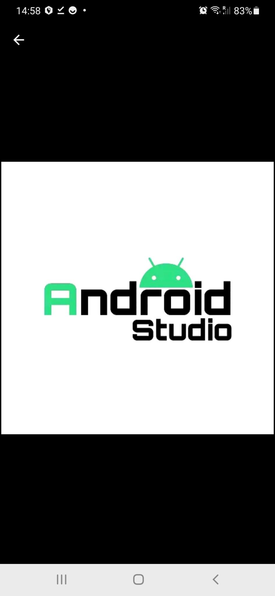

# Running

On github this is the folder containing the mobile app in Flutter.

Scan the QR code below to visit a downable `apk` file:


And install the app on your Android device. Make sure to give it the permission to use camera (it is necessary to scan QR codes inside). Also, make sure you have a screen lock* set up.

* *A `screen lock`is to ensure your phone's security, you can set up a phone lock to use a password, PIN, or Pattern. That way, even if someone gets their hands on your phone, they won't be able to access it. From Settings, swipe to and tap Lock screen. Then, tap Screen lock type and select your desired type of lock.*

## Flow of the install

*Mind you, the description has been made using an Android Phone Samsung Galaxy A50, Android version 11.*

1. The android device might warm you that there's a security risk when saving an `apk` fille on your device. Ignore this, our apk file is safe.
2. Look for the recently saved fie in your download directory and tap it to install.
3. You'll get the message (paraphrasing!)

``` For security reasons your device has not granted access```
``` to install unknown apps from this unknown source```

4. Follow the button/ link to the Setting and switch on ```allow from this source```
5. Tap 'back' and now your able to install *dkms_demo*.
6. Open it and CONFIRM the button *Scan* IS THERE underneath the sentence '1. Scan for watcher oobi:', but DON'T USE IT YET.

Platforms DKMS-DEMO has been tested on:

* Android 6 (Successfully installed and opened but stopped working) ❌
* Android 11 (pending) ✔️
* Android 10 ✔️
* Android 9 ✔️


## Compiling

### Finding the right Android studio

 

1. Get the *Google Play* store and type Android Studio. 
2. Compare the logo.
3. Install and open the app.

### How to find, install and configure the right version of Flutter
{TBW, here the team will provide more detailed info and / or links to the Google Play Library to be able to download the right app}

### Instructions

1. Make sure you have installed Android Studio on your device and configured Flutter and Dart
2. Open the `controller2_mobile_app` directory in Android Studio
3. Run `flutter pub get`
4. Run the `main.dart` file in `controller2_mobile_app/lib/`

## Building apk

1. Open the `controller2_mobile_app` directory in Android Studio
2. Run in Android Studio terminal `flutter build apk --split-per-abi`
3. Find the suitable file for your device in `build/app/outputs/flutter-apk`. For most cases it will be `app-arm64-v8a-release`.
